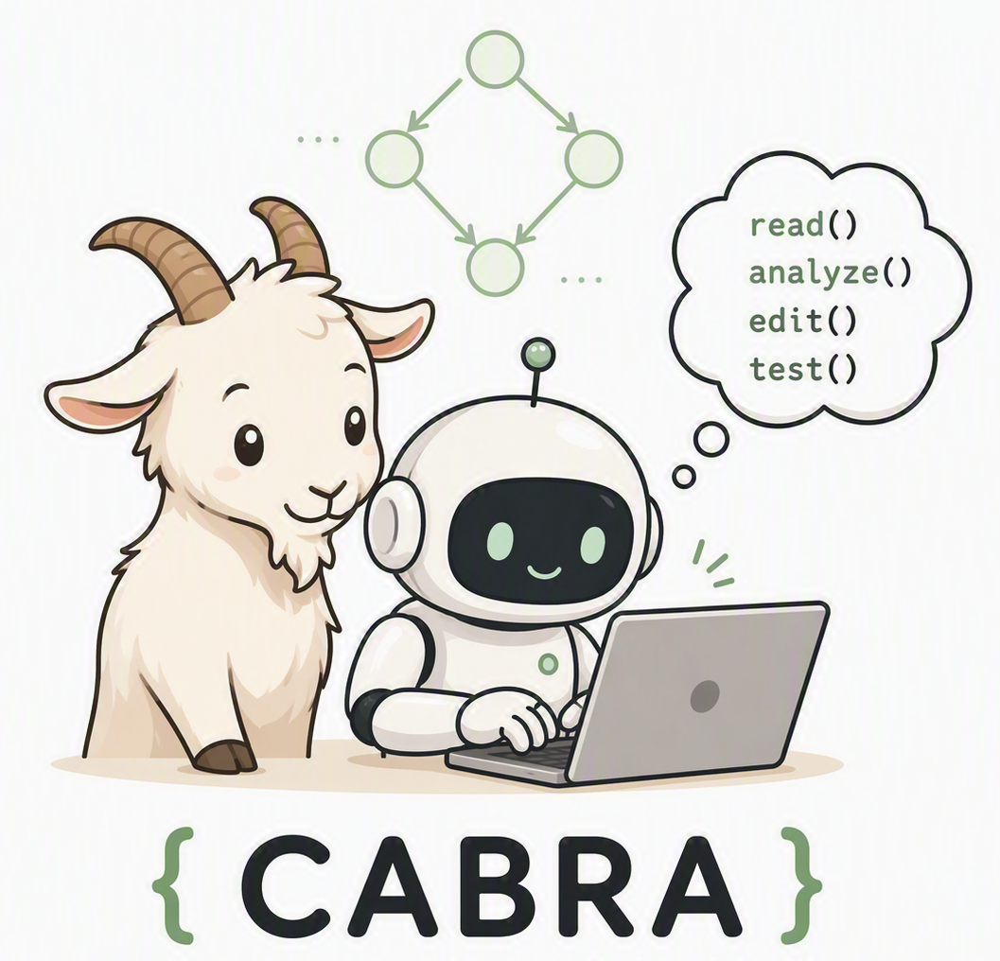
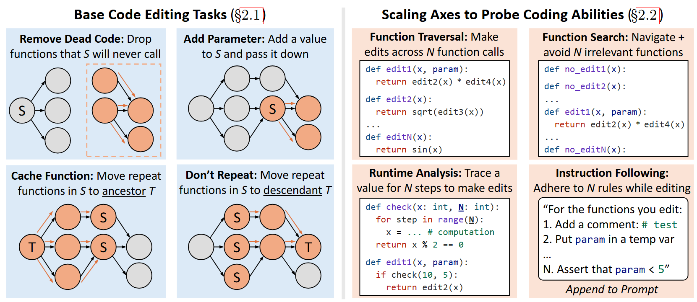
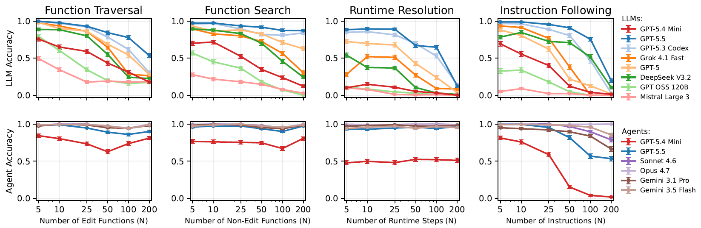
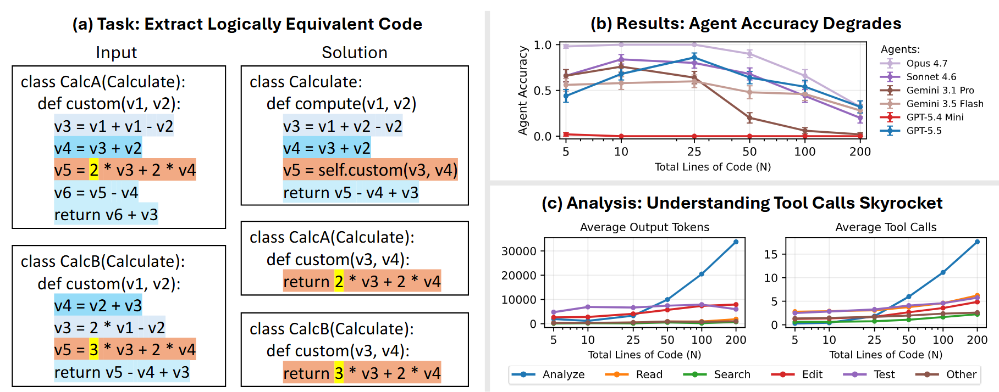

# 🐐 CABRA: Code Understanding is a Bottleneck for Coding Agents 

This repository contains the code, tasks, experiment configurations, and analysis for **CABRA**, introduced in:

<h3 align="center">
  <em>Code Understanding is a Bottleneck for Coding Agents</em>
</h3>

<p align="center">
  
</p>

**CABRA** (**C**oding **A**bility **B**lueprint for **R**igorous **A**gent evaluation) is a synthetic task framework for diagnosing coding agent abilities under controlled levels of task complexity. CABRA generates code-editing tasks from directed acyclic function call graphs and scales them along four axes: function traversal, function search, runtime resolution, and instruction following.

Across 6,840 tasks, we evaluate eight LLMs and six model configurations of the Copilot agent. Our results show that tools allow agents to solve many tasks that remain difficult for standalone LLMs, but understanding-intensive tasks still expose agent failures.

---

## 🔗 Links
Released results files are available at the project's Hugging Face dataset: [link anonymized]

Download the contents of the dataset into `CABRA/local_data/`.

---

## Herding Coding Agent Abilities with CABRA



CABRA converts sampled call graphs into executable programs and applies five families of code-editing transformations 
inspired by Martin Fowler's [catalogue of refactors](https://refactoring.com/catalog/):

1. **Remove Dead Code**
2. **Add an Input Parameter**
3. **Add a Return Value**
4. **Cache a Function Call**
5. **Don't Repeat Yourself**

Each family can be scaled to isolate a particular source of complexity:

| Ability | What CABRA scales |
|---------|-------------------|
| **Function traversal** | Number of functions through which an edit must propagate |
| **Function search** | Number of distractor functions in the codebase |
| **Runtime resolution** | Number of runtime steps required to identify the edited branch |
| **Instruction following** | Number of simultaneous editing constraints |

Based on these task results, we also design a **Merge Codebases** task to stress-test model abilities in code understanding

### Key findings



- LLM accuracy generally falls as task complexity increases.
- Coding agents remain nearly perfect on many tasks by offloading work to executable tools (e.g., `grep` to efficiently search codebases).
- On larger tasks, agents spend more tokens reading and analyzing code, not simply making more edits.
- Agents finally degrade on understanding-intensive tasks that require locating semantically divergent logic across programs:



---

## 🛠️ Setup

CABRA requires Python 3.13 or later and uses [`uv`](https://docs.astral.sh/uv/) for environment and dependency management.

Use Linux (or WSL2 on Windows) with Bash and `tmux` installed. Scoring uses Unix-only signals and does not support native Windows Python. Copilot evaluation also requires a running Docker daemon accessible to your user. Run the commands below from the repository root.

Local tool-call classification additionally requires a CUDA-compatible SGLang installation in `.venv-sglang/`; `uv sync` does not create this environment. Follow the [SGLang installation guide](https://docs.sglang.io/get_started/install.html). The supplied server script uses two GPUs (`--dp-size 2`); adjust it for your hardware. Downloaded-result plotting does not require Docker or GPUs.

### 1. Clone the repository

```bash
git clone <repository-url>
cd CABRA
```

### 2. Install dependencies

```bash
uv sync
```

### 3. Configure environment variables

Create a `.env` file in the repository root:

```dotenv
OPENROUTER_API_KEY=... # for standalone LLM evaluation and classification fallback
COPILOT_GITHUB_TOKEN=... # if you want to use Copilot
HF_TOKEN=... # if you want to use sglang
```

Standalone LLM evaluation requires an [OpenRouter API key](https://openrouter.ai/settings/keys) and a funded account.

Load these values into your shell before launching any experiments; CABRA does not load `.env` automatically:

```bash
set -a
source .env
set +a
```


### 4. Build the sandboxed Copilot harness
This repository provides code to run agent experiments in a fresh Docker container per attempt. 
Build it once before running the experiment:

```bash
docker build --tag cabra-copilot:1.0.81 docker/copilot
```
---

## 🤖 Model Backends

CABRA implements two evaluation backends behind the same interface:

| Backend | CLI value | Description |
|---------|-----------|-------------|
| **LLM** | `llm` | Calls a model directly through LiteLLM and asks it to return the complete edited codebase. |
| **Copilot Harness** | `copilot` | Runs the GitHub Copilot CLI in autopilot mode with access to coding tools. |

The backend is selected with `--agent` in `model.run_cabra` or `model.run_merge_code`. Model names and experiment-level settings are configured in each experiment's `config.yaml`.

### Authenticating LLM models

The supplied experiments use [OpenRouter through LiteLLM](https://docs.litellm.ai/docs/providers/openrouter), authenticated with `OPENROUTER_API_KEY`.

Choose models in each experiment's `config.yaml`. The default model lists are:

| Model | LiteLLM model ID |
|-------|------------------|
| GPT-5.3 Codex | `openrouter/openai/gpt-5.3-codex` |
| Grok 4.3 | `openrouter/x-ai/grok-4.3` |
| GPT-5 | `openrouter/openai/gpt-5` |
| DeepSeek V3.2 | `openrouter/deepseek/deepseek-v3.2` |
| GPT-OSS 120B | `openrouter/openai/gpt-oss-120b` |
| Mistral Large 3 | `openrouter/mistralai/mistral-large-2512` |
| GPT-5.4 Mini | `openrouter/openai/gpt-5.4-mini` |
| GPT-5.5 | `openrouter/openai/gpt-5.5` |

Check the [OpenRouter catalog](https://openrouter.ai/models) for current availability and pricing before a large run. Model versions and hosting providers may differ from those used for the published results.

The LLM backend defaults to GPT-5.4 Mini when no model is specified. All supplied OpenRouter models use Chat Completions, including Codex. CABRA defaults to medium reasoning effort for the listed GPT and Grok models, enables reasoning for DeepSeek V3.2, and sends no reasoning setting for Mistral Large 3. Explicit request settings override these defaults; for example, pass `--agent-kwargs reasoning_effort=high` to a Python runner for a model supporting that effort level.

Model IDs determine response and result paths. Configure Copilot runs separately with `copilot_models` and `COPILOT_GITHUB_TOKEN`, using model names supported by the Copilot CLI.

#### Other Providers

To use another [LiteLLM provider](https://docs.litellm.ai/docs/providers), set its model ID and credentials, such as `OPENAI_API_KEY` for `openai/gpt-4.1` or `ANTHROPIC_API_KEY` for `anthropic/claude-sonnet-4-6`. The Python runners accept `--agent-kwargs api_mode=responses` or `api_mode=chat` to select an API explicitly; direct OpenAI Codex IDs use Responses automatically.

---

## 🚀 Running CABRA

Experiment settings, including task sizes, models, paths, seeds, and concurrency, live in each experiment's `config.yaml`. Review the relevant configuration before launching a run.

Each folder under `experiments/` follows the same workflow:

| Script | Purpose |
|--------|---------|
| `generate_tasks.sh` | Generates the synthetic tasks and test cases specified by `config.yaml`. |
| `llm.sh` | Evaluates standalone LLMs without coding tools. |
| `agent.sh` | Evaluates coding agents through the Copilot harness. |
| `score.sh` | Scores model responses and writes aggregate results. |

Run a stage by passing the script from the desired experiment folder, for example:

```bash
bash experiments/function_traversal/generate_tasks.sh
bash experiments/function_traversal/llm.sh
bash experiments/function_traversal/agent.sh
```

The evaluation scripts launch parallel, detached `tmux` sessions and return immediately. Use `tmux ls` and `tmux attach -t <session>` to monitor runs. Sessions close when their commands exit; a closed session alone does not confirm success. Set `TMUX_DEBUG=true` when launching `agent.sh` to retain its panes for inspection. Only after all evaluations finish successfully, score their responses:

```bash
bash experiments/function_traversal/score.sh
```

> **Safety:** Scoring executes generated and model-produced Python code on the host, outside the Copilot Docker sandbox. Run generation and scoring only in a disposable, isolated environment without sensitive files or credentials.

For all experiments, `bash run_all.sh` generates tasks and launches background evaluations. It does not wait for them or score results. After all evaluations finish successfully, run `bash score_all.sh` separately. Scoring early can produce incomplete results. Be mindful of API and Copilot CLI costs; a full run is expensive, about $30k.

### Experiments

| Folder | Experiment |
|--------|------------|
| `experiments/function_traversal/` | Scales the number of functions through which an edit must propagate. |
| `experiments/function_search/` | Scales the number of distractor functions an agent must search through. |
| `experiments/runtime_resolution/` | Scales the runtime steps needed to identify which code should be edited. |
| `experiments/add_instructions/` | Scales the number of simultaneous editing constraints. |
| `experiments/merge_codebases/` | Tests code understanding by locating behaviorally divergent logic across otherwise equivalent programs. |

Generated tasks, model responses, and scores are written beneath `local_data/` by default. The root paths can be changed with `dag_dir`, `tasks_root`, `test_cases_root`, `response_dir`, and `output_root` in the experiment's `config.yaml`.

### Generated data layout

For the call-graph experiments, artifacts are linked by the same configuration-derived `<run-name>`. Within a run, `<task-set>` identifies the input domain (for example, `math_function`) and `<task-type>` identifies the requested transformation (for example, `add_parameter`).

| Path | Contents | Format |
|------|----------|--------|
| `local_data/dag/<run-name>/<dag-id>/dag.json` | Sampled call graphs, generated program structure, and target metadata. | One JSON object per DAG. |
| `local_data/tasks/<run-name>/<task-set>/<task-type>.json` | Prompts, source programs, reference solutions, task names, and DAG IDs consumed by model runners. | JSON array of task records. |
| `local_data/test_cases/<run-name>/<task-set>/<task-type>.json` | Executable test specifications used to compare candidate and reference behavior. | JSON array of test-suite records. |
| `local_data/responses/<run-name>/<task-set>/<task-type>/<backend>/<model>.jsonl` | Raw model outputs and run metadata. `<backend>` is typically `code` for standalone LLMs or `copilot` for Copilot runs. | One JSON record per task. |
| `local_data/results/<run-name>/<task-set>/<task-type>/<backend>/<model>.jsonl` | Per-task scoring outcomes used by aggregate analysis. | One JSON record per scored task. |

The merge codebases task generates tasks directly (without DAGs)


---

## 📊 Analysis

### Tool-call taxonomy

The scripts under `analysis/tool_calls/` classify agent tool calls according to the taxonomy introduced in the paper:

| Label | Example | Description |
|-------|---------|-------------|
| **Read** | `view solution.py` | Reading files or line spans verbatim. |
| **Search** | `grep "def check"` | Searching for a parameter, function, or string. |
| **Analyze** | `ast.parse(src)` | Analyzing dependencies, call graphs, or runtime behavior. |
| **Edit** | `edit solution.py` | Writing or revising the solution code. |
| **Test** | `pytest test.py` | Validating code via syntax checks or tests. |
| **Other** | `pip install numpy` | Any other action, such as summaries or file cleanup. |

After extracting the downloaded Copilot traces, start an SGLang server in a detached `tmux` session (this assumes GPUs are available):
The supplied script binds to all network interfaces without configuring an API key; use it only on a trusted, firewalled machine, or change `--host` to `127.0.0.1` for local-only access.

```bash
tmux new-session -d -s cabra-sglang 'bash analysis/tool_calls/sglang.sh'
tmux attach -t cabra-sglang
```

Then, in a separate session, run the classifier:
```bash
uv run python -m analysis.tool_calls.classifier \
  --dataset cabra \
  --input local_data \
  --output-dir local_data/tool_call_results
```

If SGLang classification fails after retries, the classifier uses `openrouter/openai/gpt-4.1`, authenticated with `OPENROUTER_API_KEY`. This sends trace-derived reasoning, messages, and tool arguments to OpenRouter and its selected provider and may incur charges. Add `--no-fallback` to keep SGLang classification local, or set `--fallback-model` to another LiteLLM model ID you can access.

### Recreating plots

Before running [`analysis/Analysis.ipynb`](analysis/Analysis.ipynb), generate its compact tool-call token summary if it is not included in your download:

```bash
uv run python -m analysis.summarize_tool_call_tokens \
  --tool-call-root local_data/tool_call_results \
  --traces-root local_data/copilot_traces
```

Set `--traces-root` to your extracted trace directory containing per-session `events.jsonl` or `events.jsonl.gz` files. The script combines classified calls with trace token usage and writes `local_data/tool_call_results/tool_call_token_counts.jsonl`; the notebook reads this summary rather than raw traces. Keep experiment scores under `local_data/results/` and run the notebook with `analysis/` as its working directory to recreate the plots.

---

## 📂 Project Structure

```text
├── analysis/                 # Scoring, aggregate analyses, and tool-call analyses
│   ├── tool_calls/           # Tool-call extraction and classification scripts
│   ├── Analysis.ipynb        # Paper plots and aggregate analyses
│   └── score.py              # Shared scorer used by experiment score.sh scripts
├── data/                     # DAG, task, and test-case generation
├── experiments/              # Reproducible configurations and launch scripts
│   ├── add_instructions/
│   ├── function_search/
│   ├── function_traversal/
│   ├── merge_codebases/
│   └── runtime_resolution/
├── images/                   # README and paper figures
├── local_data/               # Downloaded and generated tasks, traces, and results
├── model/                    # LLM and coding-agent evaluation runners
├── run_all.sh                # Generate tasks and launch background evaluations
├── score_all.sh              # Score responses after evaluations finish
├── pyproject.toml
└── README.md
```

---

## 📚 Citation

```bibtex
Coming Soon :) 🐐🐐🐐
```

## License

MIT License

Nothing disclosed here, including the Out of Scope Uses section below, should be interpreted as or deemed a restriction or modification to the license the code is released under.


## Transparency Documentation

### What Can CABRA Do

CABRA was developed to create controlled, executable code-editing tasks that isolate sources of difficulty for standalone language models and tool-using coding agents.
CABRA converts sampled call graphs into executable programs and applies five transformation families: Remove Dead Code, Add an Input Parameter, Add a Return Value, Cache a Function Call, and Don’t Repeat Yourself. It also includes a Merge Codebases task that stresses code understanding.

### Intended Uses

CABRA is best suited for research on coding-agent and language-model capabilities, including controlled evaluation of code traversal, code search, runtime reasoning, instruction following, and understanding of behaviorally divergent logic.
CABRA is shared with the research community to support reproduction of the reported results, analysis of model and agent weaknesses, and further research on code understanding and tool use.
CABRA is intended for researchers and developers who can independently assess generated tasks, model outputs, agent traces, and evaluation results before drawing conclusions or acting on them.

### Out-of-Scope Uses

CABRA is not intended to certify that a model or coding agent is safe, secure, reliable, or production-ready, nor to serve as a comprehensive evaluation of software-engineering ability.
CABRA was not designed or evaluated for every downstream purpose. Users should assess limitations and develop mitigations appropriate to their own models, agents, tools, environments, and intended uses.
CABRA should not be used to execute untrusted model-generated code on sensitive systems or data without appropriate sandboxing, access controls, monitoring, and human review.
Benchmark scores should not be interpreted as a complete ranking of model or agent quality; CABRA isolates specific coding abilities under synthetic, controlled conditions.


### Evaluation

CABRA was evaluated on 6,840 controlled code-editing tasks spanning function traversal, function search, runtime resolution, instruction following, and codebase merging.
The evaluation compared eight language models and six model configurations of the Copilot agent. Detailed experimental configurations, released outputs, traces, scoring results, and analysis are provided with the project artifacts and accompanying paper.

### Evaluation Methods

Evaluation used executable test cases and per-task scoring outcomes to assess whether candidate edits matched the intended behavior. Aggregate analyses examined accuracy as task complexity increased.
CABRA compared standalone LLM backends with the tool-using GitHub Copilot CLI harness.
Experiment settings--including task sizes, models, seeds, paths, and concurrency--are defined in each experiment’s `config.yaml`. Released responses and results are organized by run, task set, task type, backend, and model.
Results may vary with model choice, agent harness, tool access, credentials, configuration, environment, concurrency, and implementation changes.
The released analyses also classify agent tool calls as Read, Search, Analyze, Edit, Test, or Other to study how agents allocate effort across tasks.

### Limitations

- CABRA was developed for research and experimental purposes. Its results should not be treated as evidence that a model or agent is ready for commercial or real-world deployment.
- CABRA’s tasks, prompts, source programs, transformations, and evaluation procedures may not represent the full diversity of programming languages, repositories, workflows, or real-world software-engineering requirements.
- Evaluation through executable tests can establish behavior on the provided specifications, but passing tests does not establish correctness, security, maintainability, or robustness beyond those tests.
- Results depend on the selected models, coding-agent harnesses, tool availability, prompts, configurations, and execution environment, and may change as these components evolve.
- The evaluation includes standalone LLMs and coding agents accessed through multiple backends. Users should consult the documentation and terms for each model, service, and agent used in a reproduction or extension.
- Synthetic tasks enable controlled analysis but may not capture all ambiguity, social context, dependency constraints, or long-horizon coordination found in production development.
- Systems running coding agents should be isolated appropriately. The CABRA Copilot harness included here uses a fresh Docker container and a temporary task directory for each attempt; users remain responsible for securing credentials, networks, host resources, and any modified configurations. (The released code corresponds to the sandboxed runs described in the paper.)

### Best Practices

For reliable reproduction, record dependency versions and use the released experiment configurations, preserve seeds and run metadata, validate task generation and scoring, and record any changes to models, harnesses, tools, or environments.
Run agent evaluations in isolated environments, grant only the minimum required credentials and filesystem access, inspect prompts and generated code, and review logs and traces for unexpected behavior.

- [What is Azure AI Content Safety?](https://learn.microsoft.com/en-us/azure/ai-services/content-safety/overview)
- [Overview of Responsible AI practices for Azure OpenAI models](https://learn.microsoft.com/en-us/legal/cognitive-services/openai/overview)
- [Azure OpenAI Transparency Note](https://learn.microsoft.com/en-us/legal/cognitive-services/openai/transparency-note)
- [OpenAI’s Usage policies](https://openai.com/policies/usage-policies)
- [Azure OpenAI’s Code of Conduct](https://learn.microsoft.com/en-us/legal/cognitive-services/openai/code-of-conduct)

Users are responsible for sourcing any added datasets, repositories, models, and evaluation artifacts legally and ethically, including securing appropriate rights and protecting sensitive information.
Store tokens in environment variables. Do not commit secrets, traces containing sensitive information, or private experiment data to the repository.
Users are responsible for ensuring that their use of CABRA, its dependencies, model services, and released artifacts complies with applicable laws, licenses, terms, and organizational policies.
When reporting results, disclose the evaluated model and agent versions, tool access, configuration, seeds, environment, scoring procedure, and deviations from the released setup.


### Contact

[anonymized]